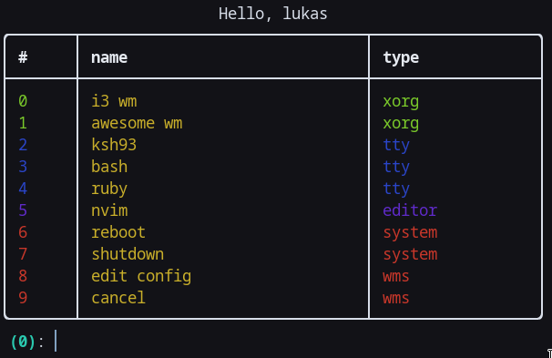

# wms

tui session selector written in python with toml config



## dependencies

* toml
* rich

## greeting script

this script executes with selected session (before session execution, after selection)<br/>
you can write it in any language, but you need add executable permissions to it (chmod +x ~/.wms)<br/>
it's located in `~/.wms` or `/etc/wms`<br/>

example greeting script with sh:
```sh
#!/bin/sh
echo "Welcome to $SHELL!"
```
same script with python:
```py
#!/usr/bin/python
from os import environ
print(f"Welcome to {environ['SHELL']}!")
```

## config

config file is located in `~/.config/wms/config.toml` (higher priority)
or in `/etc/wmsconfig.toml`<br/>
<br/>

example config:
```toml
shells = ['ksh','ruby']
editors = ['nvim']

[wms]
xorg = ['i3']

[look]
border = 'simple'
[look.colors]
desktop = 'bold green'
```
